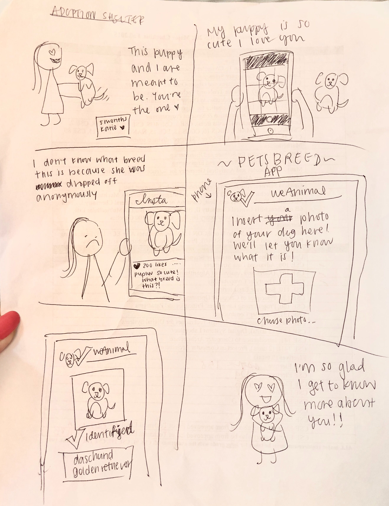
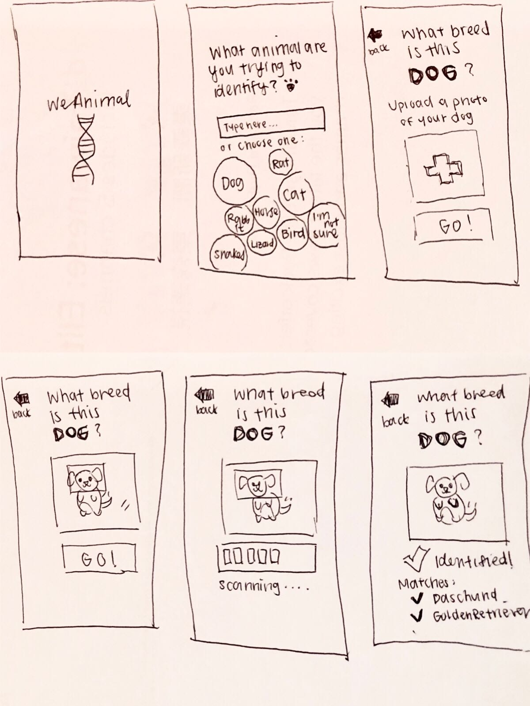
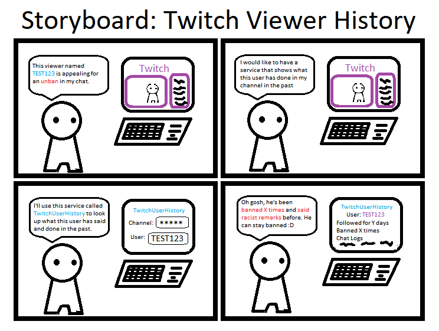
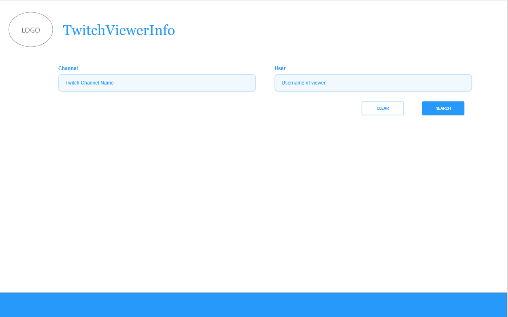
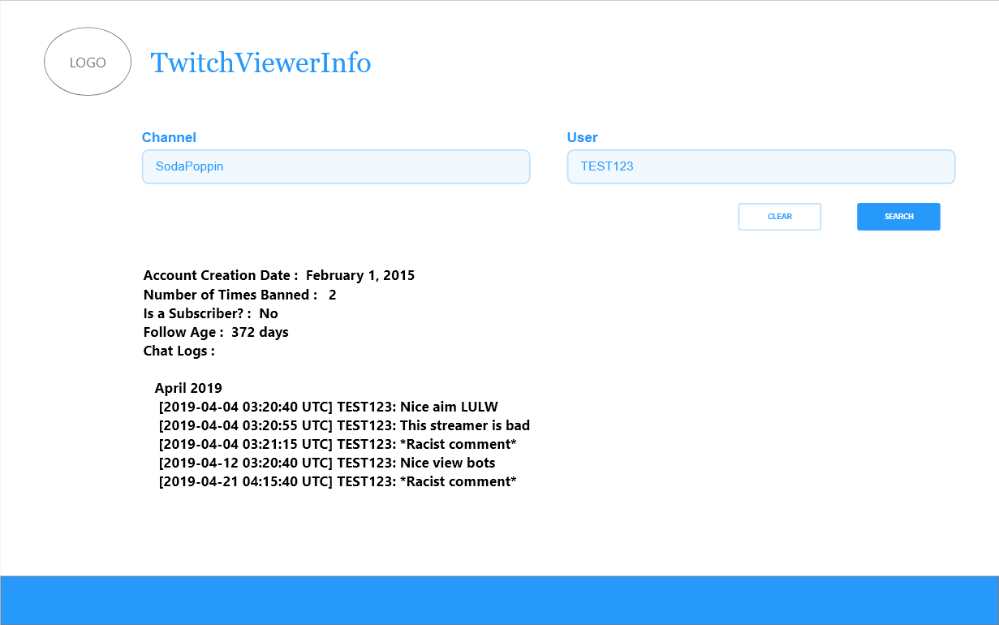

# COGS 121 Spring 2019 (Team Editted)
## Team Name
* Editted

## Team Members
* Kaung Yang
* Mingbin Li 
* Andrew Or
* Hillary Thi 

---

## Proposal 1 - WeAnimal

WeAnimal is a web application that identifies animal breeds from user uploaded photos by applying machine learning on an existing dataset of animal photos. This app is targeting pet owners that do not know what breed their pet is, commonly a result of shelter adoptions or stray adoptions. Since none of the members of Editted have pets, we do not fall into our target population and will be designing for people different from us. We will be exploring the Stanford Dogs Dataset and the Oxford-IIIT Pet Dataset, both of which contain images that have ground truth breed annotations.

### Storyboard 1

### Paper Prototype 1

---

## Proposal 2 - TwitchViewerInfo

Twitch is an online streaming platform where streamers live broadcast gaming videos, Esports, and IRL content to a viewer base. This project will create a service called TwitchViewerInfo that allows people to search for data of a Twitch viewer. By using the Twitch Developers API, when given the pair of a Twitch Streamer's channel name and a Twitch viewer's username, this app will search for and display data regarding this viewer's activity in the streamer's channel. This includes when the viewer's account was created, the viewer's chat logs in the channel, and other data pertaining to their activity in the streamer's channel. This app may be used by anyone in the Twitch community; however, it specifically targets the audience of Twitch streamers because most viewers will not need this information while spending time on Twitch. In contrast, Twitch streamers will use this service to gain a better understanding of individuals in their viewer base. For instance, when the streamer is deciding on whom to choose as a moderator for their stream, TwitchViewerInfo can be used to view the activity logs of viewers and determine who is trustworthy. This relates to the project theme of designing for people different than ourselves as our team does not fall into the population of Twitch streamers, i.e. none of us are streamers on Twitch.

### Storyboard 2

### Paper Prototype 2

---

## Proposal 3 - SafeSpot

SafeSpot is a service that provide information and prediction on various natural disasters based on location. It utilizes APIs provided by government agencies like USGS (United State Geological Survey). The target audience for this web app is people who live in or planning to travel to a location with high risk of natural disaster of someform, like earthquake, wildfire, or tornado. These people can mitigate risk by consulting SafeSpot. This project targets audience other than ourselves because we do not live in an area that is affected by natural disaster very often.

### Storyboard 3

### Paper Prototype 3

