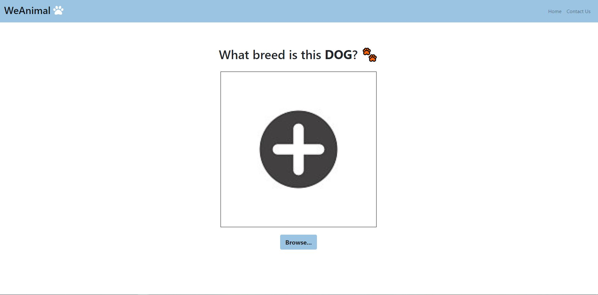

# COGS 121 Spring 2019 (Milestone 2)
## Team Name
* Editted

## Team Members
* Kaung Yang
* Mingbin Li 
* Andrew Or
* Hillary Thi 

---
### Compare current idea with Milestone 1 proposal

We will be going forward with the WeAnimal idea as proposed in Milestone 1. The idea is largely 
the same as our proposal, a service that take in a picture of dog (might support more pets in 
the future), and classify its breed using machine learning, then return relevant information to
the user, such as temperament, life span and weight.

### Compare UI skeleton to paper prototype

Our paper prototype was designed to be a mobile web app, but we decided to create a responsive 
web app because it’s a simple website with few functions, so it is likely to be accessed on either 
desktop or mobile. We have added a nav bar to our skeleton so that users can easily navigate through
our site without feeling like there are dead ends. We have also added a Contact Us page, where our 
users can send feedback or request for breeds not yet included. Besides those small changes, our 
skeleton follows our prototype.

### AJAX in project

Our AJAX call is currently triggered when the server is fetching extra information about the 
identified breed(s) to display on the client. It sends any data to hit the fetch endpoint, which 
automatically returns a predefined json of breed to description pairings inside app.js. We will keep 
the functionality of this specific ajax call pretty similar but later on, we may be sending data from 
the user-uploaded photo to the server (raw data or breeds already identified) and receiving back general
information about the identified breed in a json format.

### Real data or API

Our project will be utilizing images of dogs to train the machine learning algorithm. These images will 
be obtained through the Stanford Dogs data set, which contains over 20,000 images of 120 dog breeds. In 
addition, the project will provide characteristics regarding each dog breed via TheDogAPI api.
