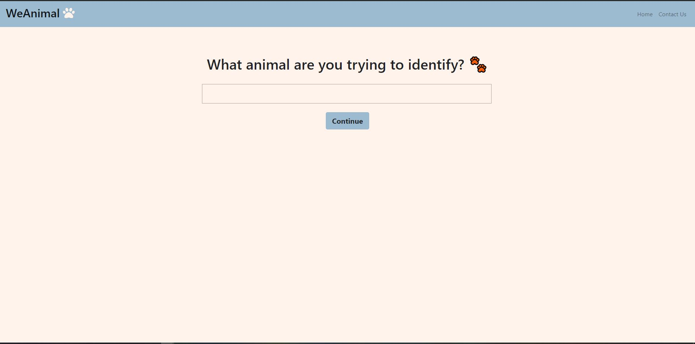
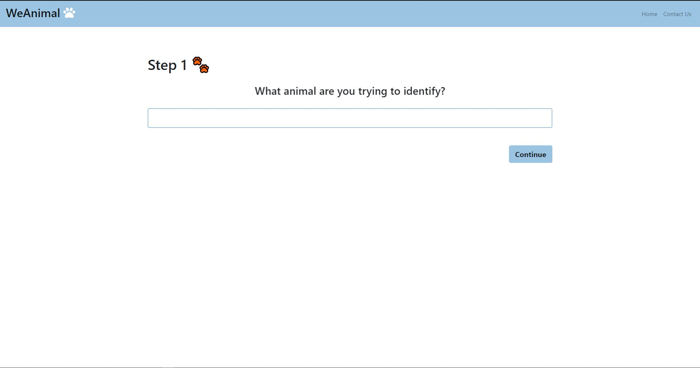
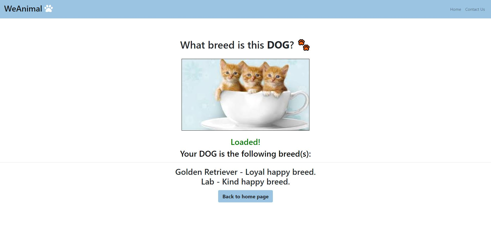
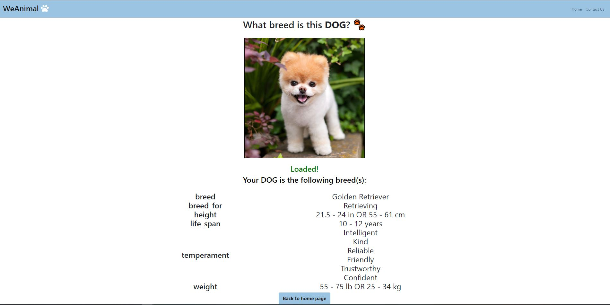

# COGS 121 Spring 2019 (Milestone 3)
## Team Name
* Editted

## Team Members
* Kaung Yang
* Mingbin Li 
* Andrew Or
* Hillary Thi 

---
## Compare current UI with Milestone2

To make our website clearer to the user, we added the text to indicate 
which step of the process the user is currently on. An animation effect was also added to
the landing page to attract our user's eyes to the main objective of this page.

### Previous 

### Now 

We also made some changes to how information was displayed on the results page. Having many lines
of information separated by a '-' character led to issues with legibility. Thus, we decided to 
display the information in two columns as the following: text left of the '-' and text to the 
right of the '-'. There are still ways we can improve upon legibility of this new version but
that will be done in future milestones.

### Previous 

### Now 

