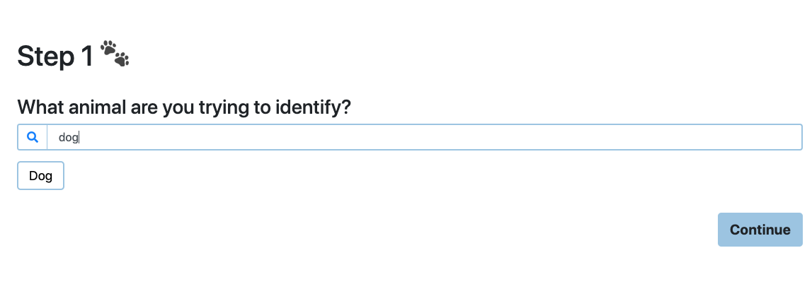

# COGS 121 Spring 2019 (Milestone 4)
## Team Name
* Editted

## Team Members
* Kaung Yang
* Mingbin Li 
* Andrew Or
* Hillary Thi 

---
## Compare current UI with Milestone2

Before when the user inputs the type of animal they wish to identify, they did not receive any visual indication to 
what animals our service is intended for. To make our website's options clearer to the user, we added the a list of animals
as well as autocomplete when the user types which animal they are identifying.

### Previous 

### Now 

We also made some changes to how information was displayed on the results page. Previously, it was displayed as unstyled text
within a table for the most likely breed. However, there are dogs that are a mix of breed, so now our application visualizes the
results of the machine learning model in the form of a pie chart. In addition, we added some css to increase the legibility of the
information on the dog's breed.

### Previous 

### Now 

---
## User Actions
* With an image of a **dog** in your local machine, use our web application to determine what breed or mix of breeds that dog is.
* With a specific breed of dogs in mind, say **Yorkshire Terrier**, use our web application to find out more information about 
this specific breed of dogs
