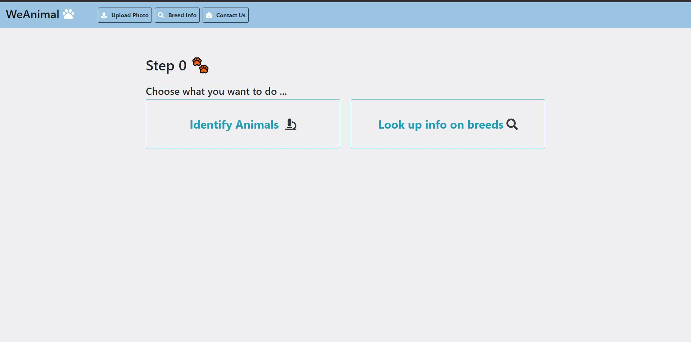
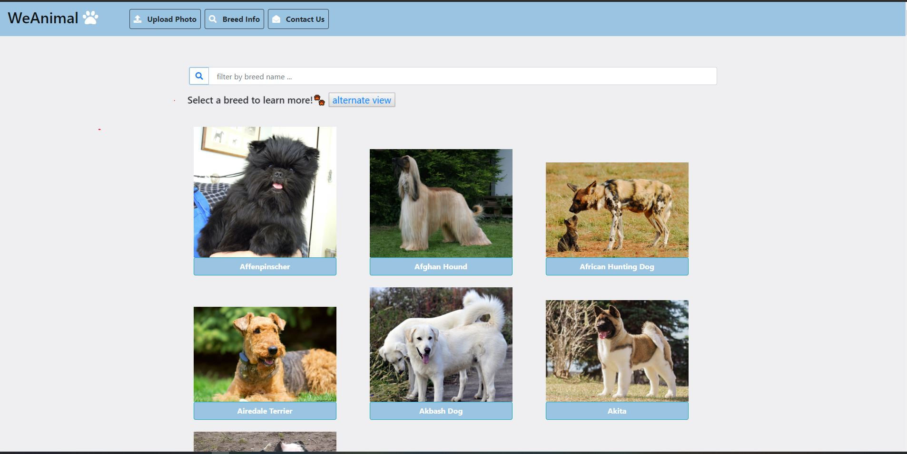
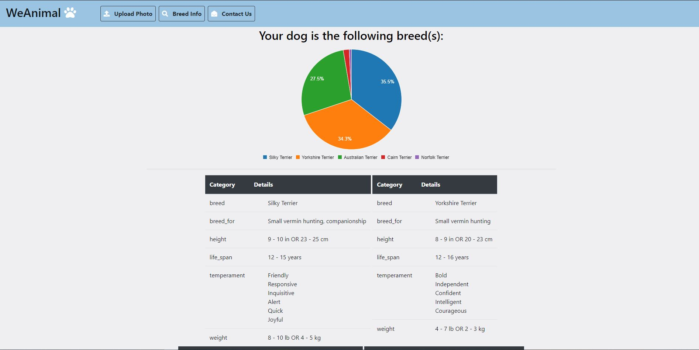

# COGS 121 Spring 2019 (Milestone 5)
## Team Name
* Editted

## Team Members
* Kaung Yang
* Mingbin Li 
* Andrew Or
* Hillary Thi 

---
## User Actions
Recall that our application's target audience are pet owners. If a individual stumbles upon a dog that they do not know the breed of, whether
that be through adoption or some other means, they may be curious on determining the breed of their dog. This individual may use our web 
application for this purpose. By taking a picture of their dog and uploading the image to our app, the user will see the results of our
machine learning model that returns a list of possible dog breeds and their likelihood. In addition, they will see general information on each 
dog breed listed. A single breed may not always be a proper result since it is possible for dogs to a mix of multiple breeds. Through using our 
web application, the user will have a better understanding of the dog they are interested in.
    
---
## UI Changes

#### Landing page

Previously, one of the main features in our app was accesible via the navigation bar. Based on the feedback we received, the design of our
landing page made it difficult to find this feature in our app. Thus, we made changes and ensured that both features of our app were visible
in the center of the landing page.

#### Information on Dog Breeds

We also made some changes to how information was displayed on the breed info page. Previously, it was displayed as a list of buttons
where users would simply manually search and scroll through the list to find a specific breed of dogs. Upon finding it, clicking, the 
button showed a table of information. The page was not user friendly as it was difficult to parse through and appeared to be a wall
of text at times. Now, we added an image for each breed of dogs and used a grid-like style to structure our buttons.

---
## Data Visualization
The data from TheDogAPI is being displayed in the form of a table. This can be seen in both the results of the machine learning
as well as the on the breed info page. The data is initially fetched from TheDogAPI through an https request and uploaded to 
firebase. Then, subsequent calls for this data are connected to our frontend through an ajax call that reads and returns the 
data from firebase database. In addition, the results of the machine learning are visualized through c3 library's pie charts.

---

## Future Data Visualization Goals
* Hovering over a section of the pie chart will filter through the tables of dog breed informations, showing only the information
of the breed that was hovered.
* Add images of each dog breed to the results of machine learning to help users recognize the name of dog breeds
* Rather than displaying the information in the dog breed information page via collapsing tables, using modals may allow for more 
  space to display the current information or additional data
